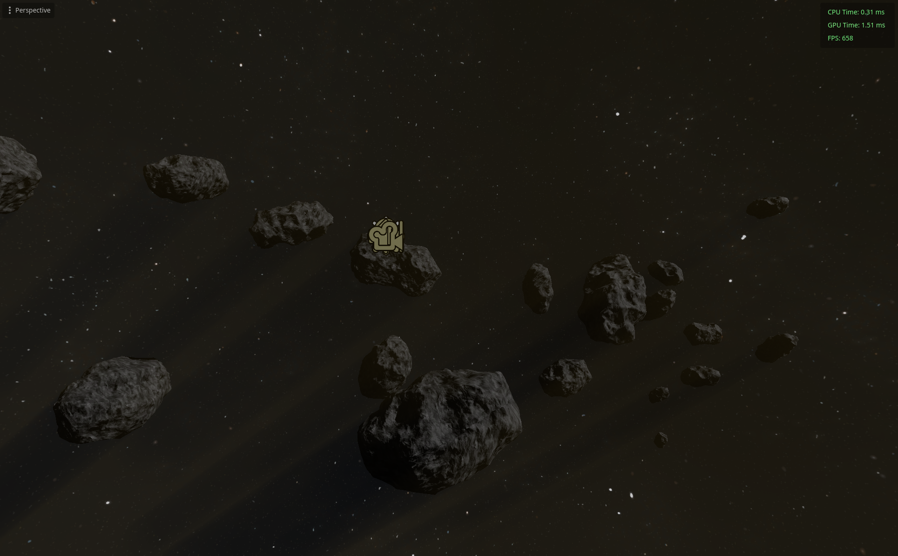

# Godot 4 compositor lens effects 🌤️
Lens flares and god rays implemented in a Godot 4 compositor effect. Tested with a recent custom build of the engine (`v4.6.dev.double.custom_build [0d529bc28]`)

---

Compositor effects are really cool. They allow you to hook into the rendering pipeline of Godot and write some nice low level shader code, while optionally having access to the shader data that Godot itself uses (see [scene_data.glsl](addons/lens_effects/shader_includes/scene_data.glsl)) and whatever else you want.

Here are some screenshots of the editor viewport (because compositor effects just run in the editor viewport too!):





And here's a video (also just a recording of the viewport, sorry for the quality):

https://github.com/user-attachments/assets/9afded05-fc36-4b94-bdd1-1c783292b4f2


## Usage
1. Download the `lens_effects` folder into your projects `res://addons/` folder
2. Create or select a `WorldEnvironment` node
3. Under `Compositor`, create a new `Compositor` and add 1 slot to the effects array
4. Select the empty slot and create a new `LensFlareEffect` (it should show up for you even without activating the plugin)
5. Add the `world_environment.gd` script (also found in the `lens_effects` folder) to the WorldEnvironment node and assign the `sun` exported variable to point at your `DirectionalLight3D`
6. Tweak some values in the `LensFlareEffect` and enjoy :)

I have tried to add some comments here and there and also hover descriptions for the parameters of the effect. Hopefully that helps.

**Note:** If you make changes to the GLSL shader file, the easiest way to reload the changes that I found is to click "Scene - Reload Saved Scene".

### Tips
- I have added hover descriptions to most settings of the effect, so feel free to use those
- To adjust how visible the rays are, the `weight` setting is useful
- If the rays look too noisy for your liking, adjust the `sample` setting (you can try `50, 100, 200, ...`)

### Double precision
If you build your engine with double precision (like I do for my project) then you should uncomment the line
```
#define USE_DOUBLE_PRECISION
```
inside of [addons/lens_effects/shader_includes/scene_data_helpers.glsl](addons/lens_effects/shader_includes/scene_data_helpers.glsl)

## Thanks to
[pink-arcana](https://github.com/pink-arcana) for their amazing example project for compositor effects here:
- https://github.com/pink-arcana/godot-distance-field-outlines
I have reused the `base_compositor_effect.gd` file with some slight modifications.

<br>

The following shadertoys:
- https://www.shadertoy.com/view/wlcyzj
- https://www.shadertoy.com/view/XsKGRW
